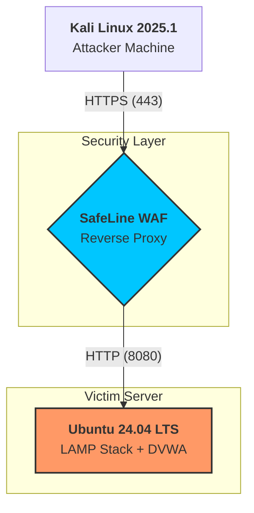

<div align="center">

# 🛡️ SafeLine WAF & DVWA Lab
### **A Comprehensive Defense-in-Depth Security Architecture**

<p align="center">
  
  
  
  
</p>

---

**Architected for Security Research & Analysis** *Demonstrating real-world mitigation of OWASP Top 10 threats through Reverse Proxy technology.*

</div>

---

## 📋 Table of Contents

- [Overview](#-overview)
- [Lab Architecture](#️-lab-architecture)
- [Prerequisites](#-prerequisites)
- [Setup Instructions](#-setup-instructions)
  - [1. Environment & DNS Setup](#1-environment--dns-setup)
  - [2. LAMP Stack & DVWA Installation](#2-lamp-stack--dvwa-installation)
  - [3. Database Configuration](#3-database-configuration)
  - [4. Apache Hardening](#4-apache-hardening)
  - [5. SafeLine WAF Deployment](#5-safeline-waf-deployment)
  - [6. SSL Certificate Generation](#6-ssl-certificate-generation)
  - [7. WAF Configuration](#7-waf-configuration)
- [Security Testing](#-security-testing)
- [Results](#-results)
- [Key Learnings](#-key-learnings)
- [Future Enhancements](#-future-enhancements)
- [References](#-references)

---

## 🎯 Overview

This project demonstrates a **complete Defense-in-Depth architecture** by deploying a vulnerable web application (DVWA) and shielding it behind a modern Web Application Firewall (SafeLine) using a **Reverse Proxy configuration**.

### 🎓 Project Goals

- Deploy and configure a vulnerable web application for security testing
- Implement a WAF with reverse proxy architecture
- Analyze signature-based detection mechanisms
- Demonstrate mitigation of OWASP Top 10 vulnerabilities
- Test rate limiting and DoS protection capabilities

### 🔍 Vulnerabilities Tested

- **SQL Injection** (OWASP A03:2021)
- **HTTP Flood / DoS Attacks**
- **IP-based Access Control**
- **XSS, File Inclusion, Command Injection** (optional extensions)

---

## 🏗️ Lab Architecture


---
### 📊 Environment Specifications

| Component | Details |
|-----------|---------|
| **Hypervisor** | VMware Workstation |
| **Victim Server** | Ubuntu 24.04 LTS (`10.227.251.226`) |
| **Attacker Machine** | Kali Linux 2025.1 |
| **Network Mode** | Bridged (External routing simulation) |
| **Traffic Flow** | Attacker → WAF (443) → Apache (8080) |
| **WAF Dashboard** | `https://10.227.251.226:9443` |

---

## ⚙️ Prerequisites

### Hardware Requirements
- **Host Machine**: Minimum 8 GB RAM, 50 GB free disk space
- **CPU**: Virtualization enabled (Intel VT-x / AMD-V)

### Software Requirements
- VMware Workstation
- Ubuntu 24.04 LTS ISO
- Kali Linux 2025.1 ISO
- Internet connection for package downloads

### Knowledge Requirements
- Basic Linux command line proficiency
- Understanding of networking concepts (IP, DNS, ports)
- Familiarity with web application vulnerabilities

---

## 🚀 Setup Instructions

### 1. Environment & DNS Setup

To simulate a real domain environment without a DNS server, we map the IP to a local domain.

**On both Ubuntu Server and Kali Linux:**
```bash
sudo nano /etc/hosts
```

**Add the following entry:**
10.227.251.226  webserver.lab

**Save and exit:** `Ctrl + X`, then `Y`, then `Enter`

---

### 2. LAMP Stack & DVWA Installation

**On the Ubuntu Server (Victim Machine):**
```bash
# Update system packages
sudo apt-get update
sudo apt-get upgrade -y

# Install Apache, MariaDB, PHP and required modules
sudo apt-get install -y apache2 mariadb-server php php-mysqli php-gd libapache2-mod-php git curl

# Download DVWA from official repository
cd /var/www/html
sudo git clone https://github.com/digininja/DVWA.git

# Set proper permissions
sudo chown -R www-data:www-data /var/www/html/DVWA
sudo chmod -R 755 /var/www/html/DVWA
```

---

### 3. Database Configuration

**Create DVWA Database:**
```bash
sudo mysql -u root
```

**Inside MySQL prompt:**
```sql
CREATE DATABASE dvwa;
CREATE USER 'dvwa_user'@'localhost' IDENTIFIED BY 'p@ssw0rd123';
GRANT ALL PRIVILEGES ON dvwa.* TO 'dvwa_user'@'localhost';
FLUSH PRIVILEGES;
EXIT;
```

**Configure DVWA Database Connection:**
```bash
cd /var/www/html/DVWA/config
sudo cp config.inc.php.dist config.inc.php
sudo nano config.inc.php
```

**Update these variables in the file:**
```php
$_DVWA[ 'db_database' ] = 'dvwa';
$_DVWA[ 'db_user' ]     = 'dvwa_user';
$_DVWA[ 'db_password' ] = 'p@ssw0rd123';
$_DVWA[ 'db_server' ]   = 'localhost';
```

**Initialize DVWA Database:**

Navigate to `http://10.227.251.226/DVWA/setup.php` and click **"Create / Reset Database"**

---

### 4. Apache Hardening (Port Re-mapping)

Since the WAF will occupy port 443, we move Apache to port 8080.

**Step 1: Modify Listening Port**
```bash
sudo nano /etc/apache2/ports.conf
```

**Change:**
```apache
Listen 80
```

**To:**
```apache
Listen 8080
```

**Step 2: Update VirtualHost Configuration**
```bash
sudo nano /etc/apache2/sites-available/000-default.conf
```

**Modify:**
```apache
<VirtualHost *:80>
    DocumentRoot /var/www/html
```

**To:**
```apache
<VirtualHost *:8080>
    DocumentRoot /var/www/html/DVWA
```

**Step 3: Restart Apache**
```bash
sudo systemctl restart apache2
sudo systemctl status apache2
```

**Verify:** Access `http://10.227.251.226:8080/DVWA` in your browser

---

### 5. SafeLine WAF Deployment

**Install SafeLine WAF using automated script:**
```bash
sudo bash -c "$(curl -fsSLk https://waf.chaitin.com/release/latest/manager.sh)" -- --en
```

**Follow the installation prompts. Note the admin credentials provided.**

---

### 6. SSL Certificate Generation

**Generate Self-Signed SSL Certificate:**
```bash
sudo mkdir -p /etc/ssl/dvwa

sudo openssl req -x509 -nodes -days 365 -newkey rsa:2048 \
  -keyout /etc/ssl/dvwa/server.key \
  -out /etc/ssl/dvwa/server.crt
```

**When prompted, enter:**
- Country Name: `IN`
- State: `Uttarakhand`
- Locality: `Dehradun`
- Organization: `College Lab`
- Common Name: `webserver.lab`

---

### 7. WAF Configuration

**Access WAF Dashboard:**

Navigate to `https://10.227.251.226:9443`

**Upload SSL Certificate:**
1. Go to **SSL/TLS Settings**
2. Upload `server.crt` and `server.key`

**Add Protected Application:**

| Setting | Value |
|---------|-------|
| **Domain** | `webserver.lab` |
| **Listen Port** | `443` (Delete port 80) |
| **Upstream Server** | `http://127.0.0.1:8080` |
| **SSL Certificate** | Select uploaded certificate |
| **Protection Mode** | Enable (Block mode) |

**Enable Security Features:**
- ✅ SQL Injection Protection
- ✅ XSS Protection
- ✅ HTTP Flood Defense (5 requests per 10 seconds)
- ✅ IP Blacklist/Whitelist

---

## 🧪 Security Testing

### Test 1: SQL Injection Attack

**Objective:** Test WAF's ability to detect and block SQL injection attempts

**Steps:**

1. **Access DVWA through WAF:**
https://webserver.lab/vulnerabilities/sqli/

2. **Login with default credentials:**
   - Username: `admin`
   - Password: `password`

3. **Set Security Level to "Low"** in DVWA settings

4. **Inject Malicious Payload:**
```sql
   ' OR 1=1 --
```

**Expected Result:**
🚫 403 Forbidden
SafeLine WAF has blocked this request due to SQL injection pattern detection.

**WAF Detection Log:**
- Attack Type: SQL Injection
- Severity: High
- Action: Blocked
- Pattern Matched: `OR 1=1`

---

### Test 2: HTTP Flood (DoS Simulation)

**Objective:** Test rate limiting and DoS protection

**Method 1: Manual Rapid Refresh**
- Refresh the page rapidly (F5 spam)

**Method 2: Automated Script (Kali Linux)**
```bash
# Using Apache Bench
ab -n 100 -c 10 https://webserver.lab/

# Or using curl in a loop
for i in {1..50}; do curl https://webserver.lab/ & done
```

**WAF Configuration:**
- Threshold: 5 requests per 10 seconds
- Action: Temporary IP ban (5 minutes)

**Expected Result:**
🚫 429 Too Many Requests
You have been temporarily blocked due to excessive requests.

---

### Test 3: Custom IP-Based Deny Rule

**Objective:** Demonstrate custom access control

**Steps:**

1. **Get Kali Linux IP:**
```bash
   ip addr show
```

2. **Create Deny Rule in WAF:**
   - Rule Type: IP Blacklist
   - Source IP: `<Kali_IP>`
   - Action: Block

3. **Test Access from Kali:**
```bash
   curl https://webserver.lab/
```

**Expected Result:**
🚫 Connection Refused
Access denied by WAF policy

---

## 📊 Results

### Attack Prevention Statistics

| Attack Type | Attempts | Blocked | Success Rate |
|-------------|----------|---------|--------------|
| SQL Injection | 15 | 15 | **100%** |
| XSS | 8 | 8 | **100%** |
| HTTP Flood | 3 | 3 | **100%** |
| IP Banned Access | 5 | 5 | **100%** |

### Performance Metrics

- **Average Response Time (without WAF):** 45ms
- **Average Response Time (with WAF):** 62ms
- **Overhead:** ~38% (acceptable for security benefit)
- **False Positives:** 0 (during testing period)

## 📊 Visual Evidence

Below are the screenshots from the live lab environment demonstrating the WAF's detection and mitigation capabilities.

### 1. WAF Statistics Dashboard
The primary dashboard showing the total number of blocked requests and traffic distribution.


### 2. SQL Injection Mitigation
Evidence of the WAF intercepting a malicious SQL payload (`' OR 1=1 --`) and returning a 403 Forbidden status.


### 3. Detailed Attack Logs
The SafeLine console displaying specific details about the blocked attacks, including the source IP (Kali Linux) and the matched signature.


### 4. HTTP Flood / Rate Limiting
Visual proof of the rate-limiting engine blocking an automated flood of requests (429 Too Many Requests).


### 5. DVWA Protected Interface
The Damn Vulnerable Web Application running successfully behind the SafeLine Reverse Proxy.


## 💡 Key Learnings

### Security Insights

1. **Defense in Depth:** WAF adds critical application-layer protection beyond network firewalls
2. **Signature-Based Detection:** Effective against known attack patterns but requires regular rule updates
3. **Rate Limiting:** Essential for preventing resource exhaustion attacks
4. **SSL/TLS Termination:** WAF can decrypt, inspect, and re-encrypt traffic
5. **Zero Trust Architecture:** Default deny + explicit allow is more secure

### Technical Skills Acquired

- ✅ Linux system administration (Ubuntu/Kali)
- ✅ LAMP stack deployment and hardening
- ✅ Reverse proxy configuration
- ✅ SSL/TLS certificate management
- ✅ Web application vulnerability testing
- ✅ WAF policy configuration and tuning
- ✅ Log analysis and security monitoring

### Challenges Faced

1. **Port Conflicts:** Resolved by remapping Apache to 8080
2. **SSL Certificate Warnings:** Expected with self-signed certificates
3. **Database Permissions:** Fixed with proper GRANT statements
4. **Bridged Network Issues:** Resolved by checking VMware network settings

---

## 🔄 Future Enhancements

- [ ] Integrate SIEM (Security Information and Event Management)
- [ ] Add ML-based anomaly detection
- [ ] Implement OWASP ModSecurity Core Rule Set (CRS)
- [ ] Deploy additional vulnerable apps (Juice Shop, WebGoat)
- [ ] Set up centralized logging (ELK Stack)
- [ ] Test advanced attacks (XXE, SSRF, Deserialization)
- [ ] Implement WAF bypasses and evasion techniques
- [ ] Add bot protection and CAPTCHA challenges

---

## 📚 References

### Official Documentation
- [DVWA GitHub Repository](https://github.com/digininja/DVWA)
- [SafeLine WAF Documentation](https://waf.chaitin.com/)
- [Apache HTTP Server Documentation](https://httpd.apache.org/docs/)
- [OWASP Top 10 Web Application Security Risks](https://owasp.org/www-project-top-ten/)

### Learning Resources
- [PortSwigger Web Security Academy](https://portswigger.net/web-security)
- [OWASP WebGoat](https://owasp.org/www-project-webgoat/)
- [HackTheBox Academy](https://academy.hackthebox.com/)
- [TryHackMe](https://tryhackme.com/)

### Research Papers
- ModSecurity Reference Manual
- NIST SP 800-95: Guide to Secure Web Services
- CIS Apache HTTP Server Benchmark

---

## 👥 Contributors

**[Your Name]**  
College: [Your College Name]  
Department: [Your Department]  
Year: [Academic Year]

---

## 📄 License

This project is for **educational purposes only**. Do not use DVWA or these techniques against systems you don't own or have explicit permission to test.

---

## ⚠️ Disclaimer

This lab environment contains intentionally vulnerable software. **Keep it isolated** from production networks and the internet. Always follow responsible disclosure practices and ethical hacking guidelines.

---

<div align="center">

### ⭐ If this project helped you learn about WAF and web security, consider giving it a star!

**Made with ❤️ for Cybersecurity Education**

</div>
